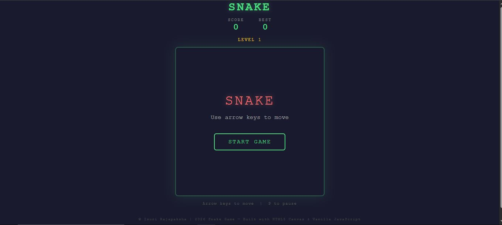
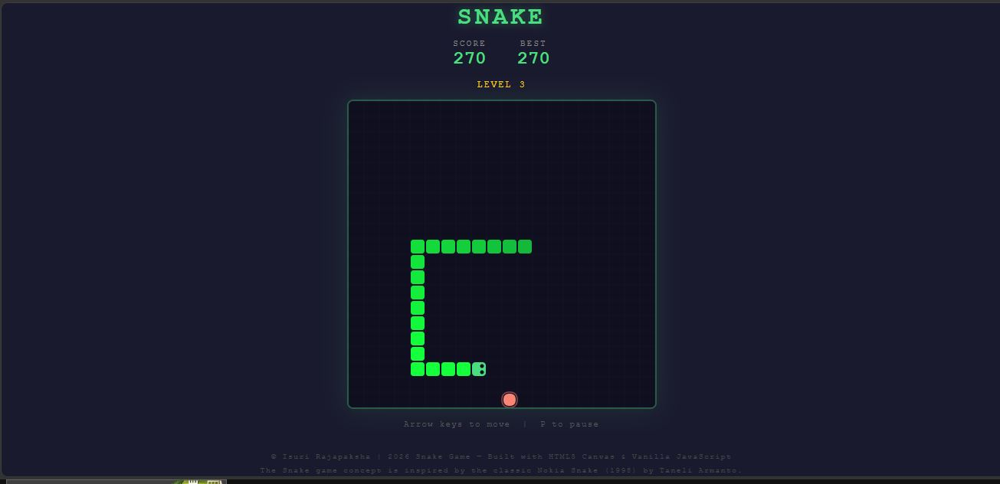
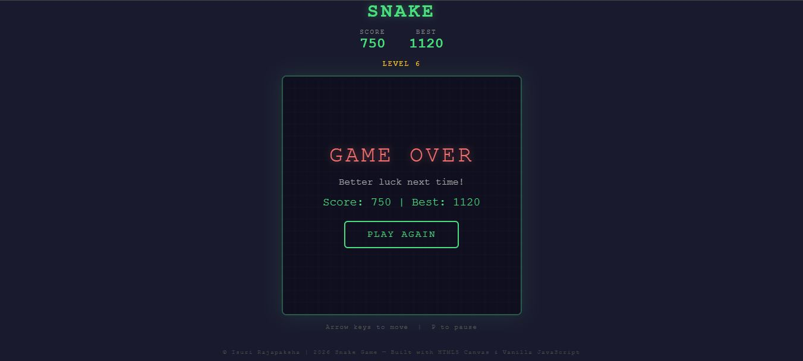

# 🐍 Snake Game

A browser-based Snake game built from scratch using HTML5 Canvas and vanilla JavaScript — no libraries, no frameworks.

Inspired by the classic Nokia Snake that we all played as kids. I wanted to bring that same feeling back, playable on any device today.

---

## 🎮 Play Now

👉 **[Play the live game here](https://YOUR-USERNAME.github.io/snake-game)**

---

## 📱 Works On

- Desktop (Chrome, Firefox, Safari, Edge)
- Mobile phones (iOS & Android) — swipe or use the on-screen d-pad
- Tablets

---

## ✨ Features

- Responsive canvas — auto-fits any screen size
- Score tracker with personal best (saved locally)
- Level system — speeds up as you grow
- Smooth rounded snake with animated eyes
- Pulsing food with glow effect
- Game over screen with replay
- Swipe controls + on-screen d-pad for mobile
- Keyboard arrow keys for desktop
- Pause with **P** key
- Fully offline — no internet needed after loading

---

## 🕹️ How to Play

| Action | Control |
|---|---|
| Move | Arrow keys / Swipe / D-pad |
| Pause | P key |
| Restart | Click "Play Again" after game over |

Eat the red food to grow. Don't hit yourself. Every 5 food = level up and faster speed.

---

## 🚀 Run Locally

No setup needed. Just download and open:

```bash
git clone https://github.com/YOUR-USERNAME/snake-game.git
cd snake-game
# Open index.html in any browser
```

Or simply [download the ZIP](https://github.com/YOUR-USERNAME/snake-game/archive/refs/heads/main.zip) and open `index.html`.

---

## 🛠️ Built With

- HTML5
- CSS3
- Vanilla JavaScript
- HTML5 Canvas API

---

## 📸 Screenshots

| Start Screen | Gameplay | Game Over |
|---|---|---|
|  |  |  |

---

## 📖 The Story Behind It

Snake was my favourite game as a kid — the kind you'd play for hours on a Nokia phone, trying to beat your own high score. When smartphones came along, that simple joy kind of disappeared under all the flashy games.

I built this to bring that memory back. Same concept, same addictive feeling — just updated for today's devices. If it makes you smile or reminds you of your childhood, that's enough for me.

---

## 📄 License

© 2024 — Built with HTML5 Canvas & Vanilla JavaScript.  
Inspired by the classic Nokia Snake (1998) by Taneli Armanto.  
Free for personal and non-commercial use.

---

## 🤝 Contributing

Found a bug or have an idea? Feel free to open an issue or submit a pull request. All contributions welcome!

---

*If you enjoy the game, consider giving it a ⭐ — it means a lot!*
